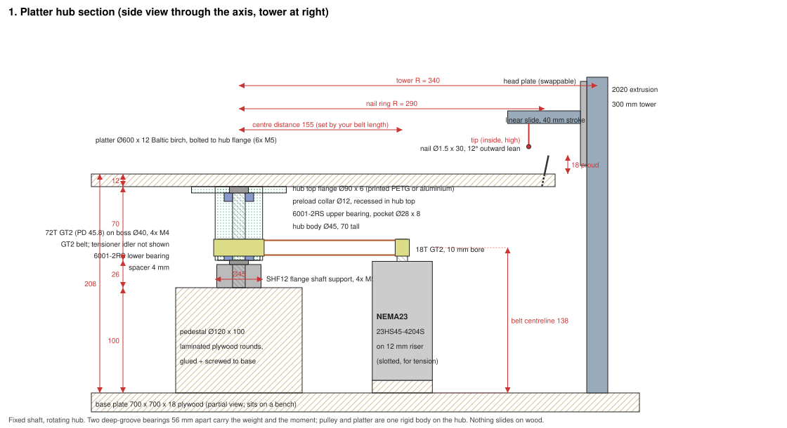
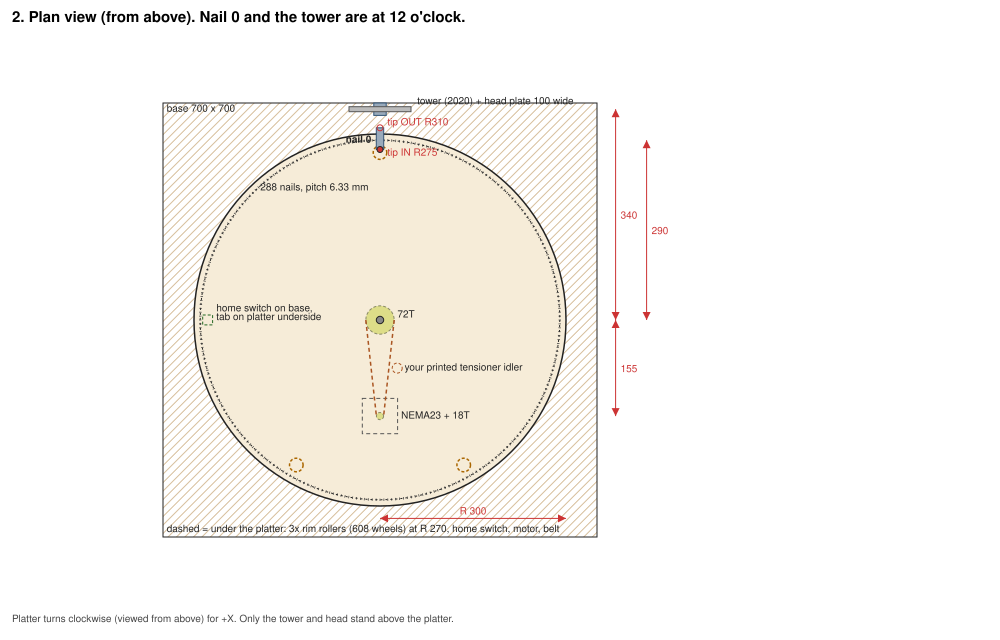
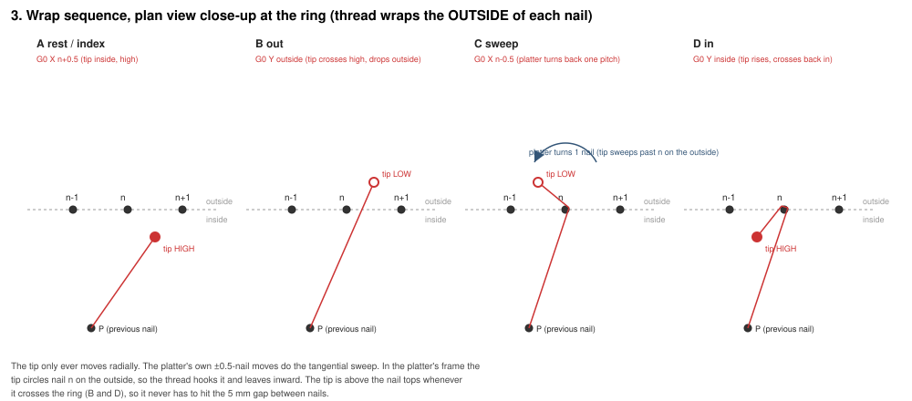
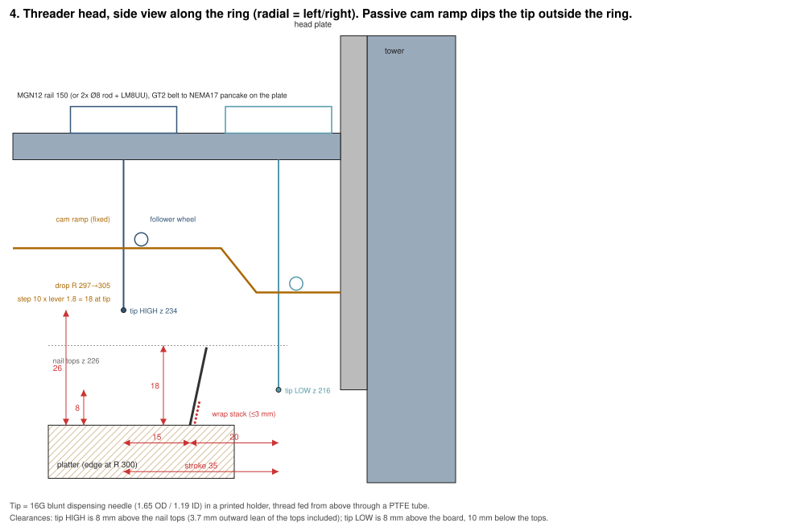
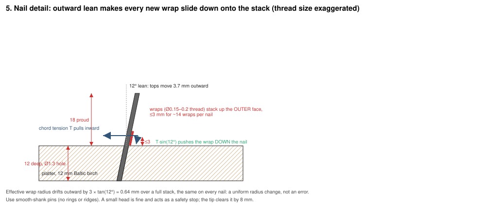

# Platter, tower and threader: mechanical design

Companion to `DESIGN.md` (BOM, electronics) and `fluidnc-config.yaml`. Diagrams are generated by
`diagrams/make_diagrams.py`; every dimension below lives in that script's `DIMS` dict, so change
it there and re-run to update the figures.

| Figure | File |
|---|---|
| 1. Hub section | `diagrams/1_hub_section.svg` |
| 2. Plan view | `diagrams/2_plan_view.svg` |
| 3. Wrap sequence | `diagrams/3_wrap_sequence.svg` |
| 4. Threader head and cam ramp | `diagrams/4_threader_head.svg` |
| 5. Nail lean and thread stack | `diagrams/5_nail_detail.svg` |







## 1. Concept and coordinate frame

- **X** is the platter, in nail units. +X turns the platter clockwise viewed from above. 72T/18T
  belt drive = **4:1**, so at 16 microsteps there are 3200 × 4 / 288 = **44.444 steps per nail**
  (already in the config), 0.028° per microstep, 0.14 mm at the nail ring.
- **Y** is the threader's radial slide. Y = 0 is homed with the tip *outside* the ring past the
  platter edge; Y = 35 puts the tip *inside* over the board. The tip rests inside between wraps.
- **Z** is the drill head's feed axis, only fitted when drilling a fresh board.
- **Nail 0** sits under the head at 12 o'clock after homing. A tab on the platter underside trips
  a microswitch on the base once per turn; after `$H`, jog until nail 0 is exactly under the tip
  and run `G10 L20 P0 X0`.
- The platter does the tangential motion at every nail; the threader only moves radially. This
  keeps the head a single axis and puts the precision in the one axis that already has it.

## 2. Dimensions as designed

All heights are from the top of the base plate.

| Item | Value |
|---|---|
| Base plate | 700 × 700 × 18 mm plywood, sits on a bench, no legs |
| Hub pedestal | Ø120 × 100 mm, laminated plywood rounds, glued and screwed |
| Shaft | Ø12 h6 steel, 96 mm long (100 → 196), clamped in an SHF12 flange support |
| Hub | Ø45 × 70 mm (126 → 196), top flange Ø90 × 6 with 6 × M5 to the platter, lower boss Ø40 × 20 for the 72T |
| Bearings | 2 × 6001-2RS (12 × 28 × 8), pockets at 126–134 and 182–190, 56 mm centres |
| Belt centreline | 138 mm |
| Platter | Ø600 × 12 mm Baltic birch, underside at 196, top at 208 |
| Nails | ring R = 290, 288 nails, pitch 6.33 mm, Ø1.5 × 30 mm, 12 mm into a Ø1.3 hole, 18 mm proud, 12° outward lean |
| Motor | NEMA23 standing on a 12 mm slotted riser under the platter, shaft up, 18T at 138; centre distance ≈ 155 (set by your belt) |
| Rim rollers | 3 × 608 bearings as wheels at R 270, 0.3 mm below the platter |
| Tower | 2020 extrusion, 300 mm, at R = 340 on the 12 o'clock line |
| Threader tip | inside R 275 (z 234), outside R 310 (z 216), 35 mm stroke; needle 16G |
| Cam ramp | high land to R 297, 45° drop to R 305, low land beyond |

Total height above the bench: about 320 mm with the tower.

## 3. Bearing setup and hub

**Why not a lazy-susan.** Furniture ring bearings have 0.3–1 mm of radial and axial play, they
rock, and the platter's angular position would depend on which way the belt last pulled. That
play shows up directly as thread-placement wobble at the rim. They also sit between the platter
and the base, right where the belt and pulley need to be.

**Design: fixed shaft, rotating hub (figure 1).**

1. A Ø12 precision shaft stands vertically in an **SHF12 flange shaft support** bolted to the
   pedestal top. This is the reference axis. The pedestal lifts the shaft base to 100 mm so the
   NEMA23 can stand on the base plate underneath the platter.
2. A **hub** (3D-printed PETG at 100% infill, or a machined aluminium tube) has a bearing pocket at
   each end for a **6001-2RS** deep-groove bearing. The two bearings are 56 mm apart. Tilt
   stiffness comes from that spacing: a bearing's own radial play of ~0.02 mm becomes only
   0.02 / 56 = 0.36 mrad of tilt, which is 0.1 mm of vertical wobble at the R 300 rim.
3. Stack, bottom to top: SHF12 (100–122), 4 mm shaft spacer, lower bearing (126–134). The
   bearing's inner race sits on the spacer; the hub's pocket shoulder rests on the outer race.
   The weight path is platter → hub → lower bearing → spacer → SHF12. Deep-groove bearings take
   this small axial load easily (the platter is ~2.5 kg).
4. Upper bearing (182–190) inside the hub top. A Ø12 shaft collar sits above it in a recess so the
   hub top face stays flat at 196. Tighten the collar just enough to remove axial play, then
   back off a hair: you want zero play, not preload.
5. The **72T pulley** bolts to the Ø40 lower boss with 4 × M4 on the pulley's flange. If your 72T has
   a small bore, print a Ø40 adapter ring for it, or re-print the pulley with a Ø40 bore and the bolt
   pattern. The belt centreline is 138 mm.
6. The **platter** bolts to the Ø90 top flange with 6 × M5 into threaded inserts or T-nuts. Centre
   the platter on the flange with a Ø45 counterbore or a printed locating ring, then bolt.

**Using your own bearings.** If the bearings you have are 608s (8 × 22 × 7, skateboard size),
use a Ø8 shaft, an SHF8 support, and Ø22 × 7 pockets. Keep the 56 mm spacing. A Ø8 shaft is
about 5× less stiff than Ø12, but with the belt tension the only real side load, its deflection
is still under 0.1 mm. Anything in the 6000/6200 series works the same way; only the pocket
sizes change.

**Alternative: rotating shaft in two flange bearings.** Bolt the shaft to the platter hub, run
it through two 12 mm flange bearing units (KFL001 or F6001 in printed housings) mounted 56 mm
apart on the pedestal, with the 72T clamped to the shaft between them. Same stiffness, one more
part to align. Use it if you already have flange units.

**Rim rollers** (figure 2). Three 608 bearings on short posts at R 270, adjusted to sit 0.3 mm
*below* the platter. They are not supports in normal running; they stop the rim from deflecting
if the arm bumps it or someone leans on it, and they take the load if the hub bearings ever
loosen. Do not set them to touch: the platter is not perfectly flat and touching rollers would
rock it against the hub bearings.

## 4. Platter

- **12 mm Baltic birch plywood**, not MDF. It is stiffer, flatter, and holds nails without
  splitting or letting them walk out under tension. Cut the Ø600 disc with a router trammel.
- Drill the nail ring with the machine (`post.py --drill`) once the drill head exists, or with a
  printed drilling jig indexed off the hub. Either way the machine's own homing defines nail 0,
  so hole-to-hole consistency matters more than absolute angle.
- Press-fit the nails: Ø1.3 hole, Ø1.5 pin, 12 mm deep, at the 12° lean. A printed height gauge
  sets all pins to 18 mm proud.
- Glue a small tab (a 20 mm block) under the platter at R 280 for the home switch.
- Balance is not an issue at these speeds.

## 5. Drive

| | |
|---|---|
| Ratio | 72/18 = 4:1 |
| Pitch diameters | 72T = 45.8 mm, 18T = 11.5 mm |
| Belt centreline | 138 mm above the base |
| Centre distance | (L − π(45.8 + 11.5)/2) / 2 ≈ (L − 90)/2 for a belt of length L; a 400 mm belt gives 155 mm |
| Motor mount | NEMA23 standing on a 12 mm plywood riser with 4 slotted holes radial to the hub, so the whole motor slides to tension the belt. Your printed tensioner idler goes on the slack span. |
| Backlash | GT2 backlash of ~0.1 mm at the belt is 0.1 / 22.9 = 0.25° at the platter, or 1.3 mm at the ring. Because the tip never has to hit the gap between nails (section 8), this only matters for the ±0.5 nail sweep, which has 3 mm of margin either way. |
| Torque | 3 N·m at the motor (2.4 N·m at the 3.31 A setting) × 4 = ~9 N·m at the platter. The platter's inertia is 0.1 kg·m². You are limited by belt tension, not torque. Raise the X acceleration in the config from 30 to 300 nails/s² once the machine runs. |

## 6. Base

An 18 mm plywood square, 700 mm, on a bench. Everything mounts to its top face: pedestal in the
centre, motor riser at ~155 mm on the 6 o'clock line, three roller posts at R 270, the home
switch at R 280 on the 9 o'clock line, the tower foot at R 340 on the 12 o'clock line. Nothing
hangs below, so no legs are needed. If you want it free-standing later, add four legs at the
corners; the base plate is already the frame.

## 7. Tower and swappable heads

- **Tower:** a single 300 mm length of 2020 aluminium extrusion, bolted to the base through a
  printed or angle-bracket foot, on the 12 o'clock line at R 340. Extrusion gives you T-slots to
  mount and shim the head plate without drilling wood twice.
- **Tower plate:** a fixed 6 mm aluminium (or 12 mm plywood) plate on the tower's inner face with
  two **Ø6 dowel pins** and two **M5 threaded holes**. This plate never moves once set.
- **Head plates:** each head (threader, drill) is built on its own 100 × 120 mm plate with two
  Ø6 reamed holes and two clearance holes. Swap = drop it on the dowels and turn two thumbscrews.
  Repeatability from the dowels is better than 0.1 mm, well inside what either head needs.
- **Electrical:** each head carries its own NEMA17 and its own endstop, wired to a 6-pin
  connector. The threader plugs into the board's Y socket, the drill into Z. Nothing is shared,
  so nothing is re-wired at a swap. The G-code for each mode only commands its own axis.
- Both heads put their working point (needle tip, drill point) on the nail ring at R 290 on the
  12 o'clock line. Set this once per head with the slotted holes in each head plate.

## 8. Threader head

### Mechanism (figure 4)

- **Slide:** an MGN12H rail and carriage, 150 mm, mounted horizontally on the head plate pointing
  at the hub. A 2 × Ø8 rod + LM8UU slide works too. Stroke used: 35 mm (R 275 to R 310) of a
  40 mm travel.
- **Drive:** the 17HE08 pancake on a 20T GT2 pulley and an idler, belt clamped to the carriage.
  80 steps/mm at 16 microsteps (already in the config). Endstop at the *outside* end so Y = 0 is
  past the platter edge, where the tip can never touch anything.
- **Tip arm:** a lever hinged on the carriage (hinge axis tangential to the ring), reaching down
  to the needle. A small **follower wheel** on the lever rides on a **cam ramp** fixed to the head
  plate. Gravity, or a light spring, keeps the follower on the ramp.
- **Cam ramp:** flat high land from the inside end to R 297, then a 45° drop of 10 mm between
  R 297 and R 305, then a flat low land. With a 1.8:1 lever the tip moves 18 mm: **high = z 234**,
  8 mm over the nail tops (which lean out to R 293.7, so the crossing at R 297 clears them);
  **low = z 216**, 8 mm above the board and 10 mm below the tops.
- **Needle:** a 16G blunt dispensing needle (1.65 mm OD, 1.19 mm ID) in a printed holder, pointing
  down. Thread arrives through a PTFE tube from above. The needle's ID passes Tex 30 thread with
  room to spare and has no edge to fray it.

### Motion sequence and why (figure 3)

Between wraps the tip rests **inside** the ring, high, so the thread runs from the last nail
across the board to the tip. To wrap nail n the machine does exactly four moves, which is what
`post.py` emits:

```
G0 X n+0.5 Y35   index: nail n arrives half a pitch past the arm line (tip inside, high)
G0 Y0            tip crosses the ring high, descends the ramp, ends low outside at R 310
G0 X n-0.5       platter turns back one pitch: in the platter's frame the tip sweeps past nail n
                 on the outside, dragging the thread across n's outer face
G0 Y35           tip climbs the ramp, crosses back in high: the thread now loops n and heads inward
```

**Why the platter sweeps and the arm doesn't.** The arm could do everything with a second,
tangential axis, but that doubles the head, its wiring and its calibration, and the platter has to
move to the next nail anyway. A ±0.5 nail platter move is 3 mm at the rim and takes a fraction of
a second with a 4:1 belt. Dring's machine and every derivative work this way for the same reason.

**Why the dip.** If the tip crossed the ring at nail height it would have to pass through the
5 mm gap between nails, which needs the platter positioned within ±1.5 mm at the rim on every
crossing, and belt backlash alone can eat that. Crossing *above* the nail tops removes the
requirement entirely: the only place the tip is low is outside the ring, where there is nothing
to hit. The thread still ends up low because the tip is low during the sweep (move C), so the
thread lands on the nail near its base, on top of the existing wraps.

**Alternatives if the ramp misbehaves.** An SG90 on the carriage lifting the needle, driven as a
FluidNC `rc_servo` axis, does the same job actively. Or drop the dip altogether, run the tip at
nail mid-height through the gaps, and enable same-direction approach in the post-processor so
backlash cancels. The ramp is recommended because it has no electronics and cannot get out of
sync with the G-code.

### Timing

Per nail: two 35 mm arm moves at 4000 mm/min ≈ 1.2 s, the 1-nail sweep ≈ 0.3 s, and the index
move, averaging a quarter turn = 72 nails, ≈ 2.5 s at 2000 nails/min. About **4 s per line,
4.5 h for 4000 lines**. Raising X to 4000 nails/min and 300 nails/s² acceleration roughly halves
that once the belt is proven.

## 9. Thread path and tension

Spool on a spindle on the tower → your tensioner → a **redirect eyelet above the tower**, at
least 100 mm higher than the carriage → down through a PTFE tube to the needle. The high
redirect matters: the thread must always descend to the needle so it never drags across nails
or the interior chords. The tensioner has to absorb 35 mm of thread per arm stroke; a
spring-loaded dancer arm with 40 mm of travel does it, a friction-only tensioner will jerk. Aim
for 1–2 N of tension: enough to seat the wrap, not enough to bow the platter over 4000 lines.

A thread-break detector is a microswitch lever the thread holds down between the redirect and
the needle, wired to a spare input as a feed-hold. Optional but cheap.

## 10. Keeping wraps neat (figure 5)

The failure you are worried about, wraps piling up and shifting chords, is controlled by five things:

1. **Outward lean.** At 12° the inward chord tension has a component T·sin 12° = 0.21 T pushing
   every wrap *down* the nail. Wraps self-stack from the base up. Less than 8° and friction wins
   and wraps can hang high; more than 15° and the tops move out enough to complicate the ring crossing.
2. **Low placement.** The tip is at board + 8 mm during the sweep, so each wrap is laid at the
   stack height, not dropped from the nail top. It lands where it will live.
3. **Stack size is small.** 4000 lines / 288 nails ≈ 14 wraps per nail; at 0.2 mm each that is
   under 3 mm of stack on an 18 mm nail. The effective wrap radius drifts out by 3 × tan 12° =
   0.6 mm over the whole piece. That is the same on every nail, so it is a uniform 0.2% radius
   change, invisible in the image.
4. **Smooth pins, constant tension.** Ridged nails and tension spikes are what make wraps climb.
   Use smooth-shank pins or hardened dowel pins, and let the dancer arm do its job.
5. **Order does not matter.** Chords cross the interior above earlier chords; that is how string
   art works. Nothing needs to be threaded under anything. Only the wrap at the nail has to be
   at the right height, which items 1 and 2 handle.

If a wrap ever does sit high, the next platter move with tension on will usually pull it down.
If you see it happen repeatedly on one nail, that nail is under-leaned or has a burr.

## 11. Drill head

- Same 100 × 120 head plate, dowels and thumbscrews. Carries a **T8 lead-screw Z slide** (2 × Ø8
  rods, LM8UU, 8 mm lead nut, 400 steps/mm) with the 17HE08 on top, and the 555 drill motor
  clamped to the carriage. Endstop at the top.
- The **whole slide is mounted at 12° from vertical**, top leaning outward, so the drilled hole
  has the nail lean built in. The drill point meets the board at R 290 on the 12 o'clock line.
- Bit: Ø1.3 mm HSS, depth 12 mm, feed 100 mm/min (`post.py --drill --feed-z 100`). The 555 at
  24 V runs about 8000 rpm unloaded, fine for a 1.3 mm bit in birch. Peck if you see chips packing.
- The drill relay is driven by M3/M5, which `post.py --drill` already emits.
- A small brush or vacuum nozzle on the plate keeps chips off the ring. Drill all 288 holes,
  swap heads, press nails, run.

## 12. Accuracy budget at the nail ring

| Source | Size at R 290 | Matters? |
|---|---|---|
| Microstep | 0.14 mm | no |
| Belt backlash | up to 1.3 mm | only if the tip had to pass between nails; the dip removes it |
| Homing repeatability (lever microswitch at R 280) | ~0.1 mm | no |
| Hub bearing tilt | 0.1 mm vertical at the rim | no |
| Platter flatness (birch, 600 mm) | ±0.3 mm vertical | no; the 8 mm tip clearances absorb it |
| Nail hole position | ±0.3 mm | no; the wrap finds the nail |
| Nail lean scatter | ±2° → ±0.6 mm at the top | no |
| Stack drift | 0.6 mm outward over the piece, uniform | no |
| Nail count vs. generator | must match exactly | **yes**, the only hard requirement |

The mechanical design has a lot of margin on purpose. The wrap sequence needs the platter within
about ±3 mm at the ring for the sweep, and the design holds it within ~1.5 mm worst case.

## 13. Build and calibration order

1. Base plate, pedestal, SHF12, shaft. Check the shaft is square to the base with a square.
2. Hub with bearings, spacer, collar. Spin it by hand: silent, no play, no tight spots.
3. 72T on the boss, motor on the riser, belt, tensioner. Spin by hand: no tooth skipping.
4. Platter bolted on. Check rim runout with a pencil on a block: under 1 mm radial, under 0.5 mm
   vertical. Set the three rim rollers 0.3 mm below.
5. Home switch and tab. FluidNC `$H` on X, then jog and `G10 L20 P0 X0`.
6. Tower, tower plate, dowels. Fit the drill head, drill the ring, press nails, check heights.
7. Fit the threader head. With no thread, run `post.py` on a 20-line test sequence and watch the
   tip: high over the ring, low outside, sweep clears the nail by ~2 mm each side. Adjust the ramp
   position (R 297 to 305) and `--y-inside` / `--y-outside` until it does.
8. Tie thread to nail 0, run the 20-line test with thread, inspect the wraps, then run the full file.

## 14. Parts this design adds

| Part | Qty | Approx. |
|---|---|---|
| SHF12 flange shaft support | 1 | $8 |
| Ø12 × 100 mm hardened shaft (h6, ground) | 1 | $8 |
| 6001-2RS bearings | 2 | $6 |
| Ø12 shaft collars | 2 | $6 |
| Baltic birch plywood 12 mm, 600 × 600 | 1 | $25 |
| Plywood 18 mm for base and pedestal | 1 sheet offcut | $20 |
| 2020 extrusion 300 mm, foot bracket, T-nuts | 1 | $12 |
| MGN12H rail 150 mm + carriage | 1 | $12 |
| GT2 20T pulley (5 mm bore), idler, 6 mm belt 1 m | 1 set | $10 |
| T8 lead screw 100 mm + nut, 2 × Ø8 × 150 rods, 4 × LM8UU | 1 set | $15 |
| 16G blunt dispensing needles | pack | $6 |
| Ø6 dowel pins, M5 thumbscrews | 2 + 2 | $6 |
| 608 bearings for rim rollers | 3 | on hand? |
| Ø1.5 × 30 mm smooth pins, 300 | 1 | $12 |
| Ø1.3 mm HSS bits | 5 | $6 |
